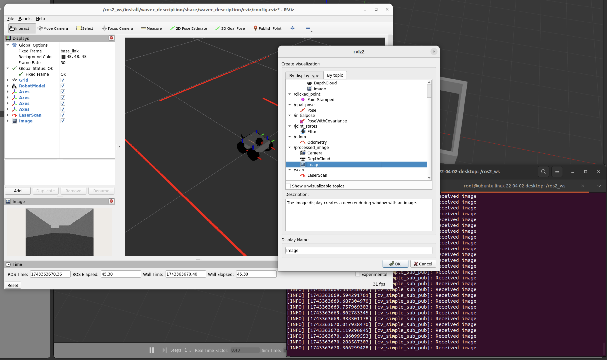

# Computer Vision with OpenCV and ROS2
(We assume that you have already installed the Waver simulation and the required dependencies. If not, please refer to the [Installation Guide](../00_installation/README.md) for instructions.)

In this section you will interact with the Waver robot Simulation using OpenCV and ROS2. The goal is to create a simple computer vision application that can detect and track objects in the environment.

Let's start in the `ROS2_Docker_UI` with VSCode. Enter to the container and build the workspace:
```bash
./scripts/run
```

Then build the workspace:
```bash
colcon build
```

Execute the ROS2 simulation:
```bash
ros2 launch waver_description view_gazebo_rviz.launch.py
```

Now open a new terminal and enter to the container. Remember you will use this terminal to run the computer vision node for every change you do:
```bash
./scripts/bash
## once inside the container
source /ros2_ws/install/setup.bash
```

Execute the computer vision node:
```bash
ros2 run waver_cv simple_sub_pub
```

Now in RVIZ you can see the result of the computer vision node. The image is published in the `/processed_image` topic. So, take a look at the following image:



Now it's time to play with the code. The code is located in the `waver_cv/waver_cv` package. You can find it in the `src` directory of the `ros2_ws` workspace.

Open the `simple_sub_pub.py` python script in VSCode. Locate the function `listener_callback` and modify the code to add your own computer vision algorithm. For example, you can use OpenCV to detect edges, contours, or any other feature you want.

This node subscribes to the `/camera/image_raw` topic and publishes the processed image in the `/processed_image` topic.

Use any smart chat like ChatGPT to help you to modify the code. The following is a good prompt example:

```markdown
Based on the following python function, help me to detect the edges of the image and then apply a dilation operation to the edges:
    ```python
    def listener_callback(self, msg):
            self.get_logger().info('Received image')
            # Convert ROS Image message to OpenCV image
            cv_image = self.bridge.imgmsg_to_cv2(msg, desired_encoding='bgr8')
            # Convert the image to grayscale
            gray_image = cv2.cvtColor(cv_image, cv2.COLOR_BGR2GRAY)
            # Apply binary threshold
            _, binary_image = cv2.threshold(gray_image, 127, 255, cv2.THRESH_BINARY)
            # Display the binary image
            # Convert the binary image back to ROS Image message
            binary_image_msg = self.bridge.cv2_to_imgmsg(binary_image, encoding='mono8')
            # Publish the binary image
            self.publisher_.publish(binary_image_msg)
    ```
```

For every change you made in the code, you must to stop the node with `Ctrl+C` and then rebuild the workspace to apply the changes:
```bash
colcon build
source /ros2_ws/install/setup.bash
```

Then, you can run the node again:
```bash
ros2 run waver_cv simple_sub_pub
```

